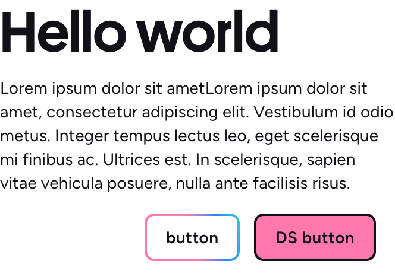
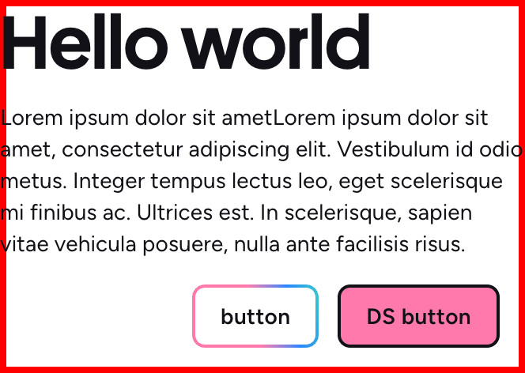
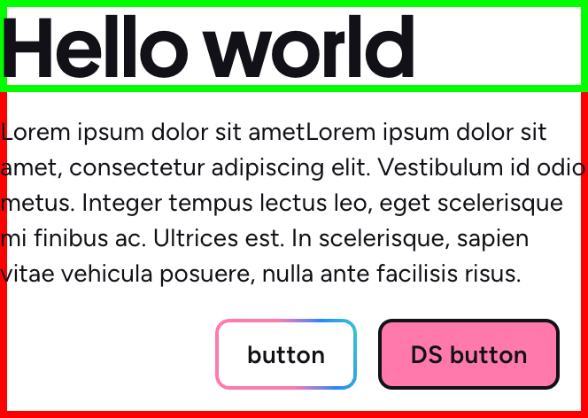
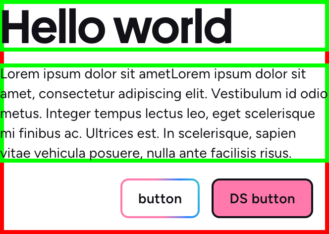
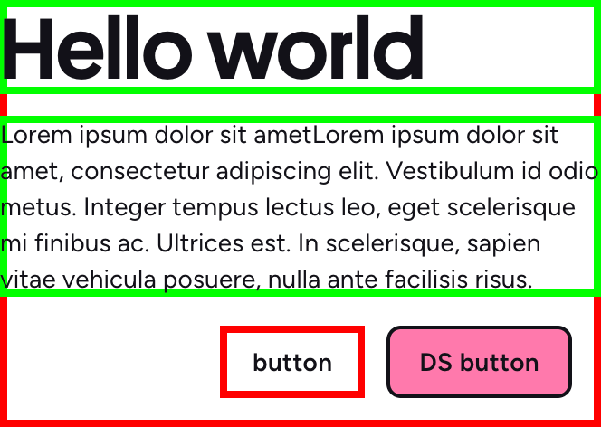
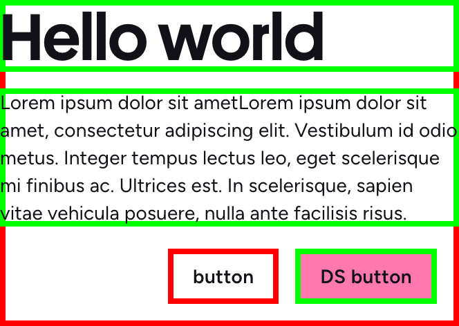
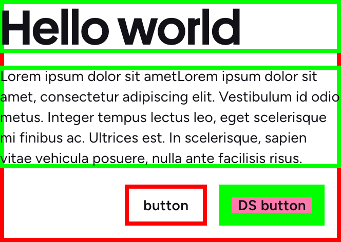

Step by step



DOM parse result
```json
[


]
```

::right::

<div class="ml-20">

Bitmap
```
⬛️⬛️⬛️⬛️⬛️⬛️⬛️⬛️⬛️⬛️⬛️⬛️⬛️⬛️⬛️⬛️⬛️⬛️⬛️⬛️
⬛️⬛️⬛️⬛️⬛️⬛️⬛️⬛️⬛️⬛️⬛️⬛️⬛️⬛️⬛️⬛️⬛️⬛️⬛️⬛️
⬛️⬛️⬛️⬛️⬛️⬛️⬛️⬛️⬛️⬛️⬛️⬛️⬛️⬛️⬛️⬛️⬛️⬛️⬛️⬛️
⬛️⬛️⬛️⬛️⬛️⬛️⬛️⬛️⬛️⬛️⬛️⬛️⬛️⬛️⬛️⬛️⬛️⬛️⬛️⬛️
⬛️⬛️⬛️⬛️⬛️⬛️⬛️⬛️⬛️⬛️⬛️⬛️⬛️⬛️⬛️⬛️⬛️⬛️⬛️⬛️
⬛️⬛️⬛️⬛️⬛️⬛️⬛️⬛️⬛️⬛️⬛️⬛️⬛️⬛️⬛️⬛️⬛️⬛️⬛️⬛️
⬛️⬛️⬛️⬛️⬛️⬛️⬛️⬛️⬛️⬛️⬛️⬛️⬛️⬛️⬛️⬛️⬛️⬛️⬛️⬛️
⬛️⬛️⬛️⬛️⬛️⬛️⬛️⬛️⬛️⬛️⬛️⬛️⬛️⬛️⬛️⬛️⬛️⬛️⬛️⬛️
⬛️⬛️⬛️⬛️⬛️⬛️⬛️⬛️⬛️⬛️⬛️⬛️⬛️⬛️⬛️⬛️⬛️⬛️⬛️⬛️
⬛️⬛️⬛️⬛️⬛️⬛️⬛️⬛️⬛️⬛️⬛️⬛️⬛️⬛️⬛️⬛️⬛️⬛️⬛️⬛️
⬛️⬛️⬛️⬛️⬛️⬛️⬛️⬛️⬛️⬛️⬛️⬛️⬛️⬛️⬛️⬛️⬛️⬛️⬛️⬛️
⬛️⬛️⬛️⬛️⬛️⬛️⬛️⬛️⬛️⬛️⬛️⬛️⬛️⬛️⬛️⬛️⬛️⬛️⬛️⬛️
⬛️⬛️⬛️⬛️⬛️⬛️⬛️⬛️⬛️⬛️⬛️⬛️⬛️⬛️⬛️⬛️⬛️⬛️⬛️⬛️
⬛️⬛️⬛️⬛️⬛️⬛️⬛️⬛️⬛️⬛️⬛️⬛️⬛️⬛️⬛️⬛️⬛️⬛️⬛️⬛️
⬛️⬛️⬛️⬛️⬛️⬛️⬛️⬛️⬛️⬛️⬛️⬛️⬛️⬛️⬛️⬛️⬛️⬛️⬛️⬛️
⬛️⬛️⬛️⬛️⬛️⬛️⬛️⬛️⬛️⬛️⬛️⬛️⬛️⬛️⬛️⬛️⬛️⬛️⬛️⬛️
```

</div>

---
layout: two-cols
transition: null
---

Step by step



DOM parse result
```json
[


]
```

::right::

<div class="ml-20">

Bitmap
```
⬛️⬛️⬛️⬛️⬛️⬛️⬛️⬛️⬛️⬛️⬛️⬛️⬛️⬛️⬛️⬛️⬛️⬛️⬛️⬛️
⬛️⬛️⬛️⬛️⬛️⬛️⬛️⬛️⬛️⬛️⬛️⬛️⬛️⬛️⬛️⬛️⬛️⬛️⬛️⬛️
⬛️⬛️⬛️⬛️⬛️⬛️⬛️⬛️⬛️⬛️⬛️⬛️⬛️⬛️⬛️⬛️⬛️⬛️⬛️⬛️
⬛️⬛️⬛️⬛️⬛️⬛️⬛️⬛️⬛️⬛️⬛️⬛️⬛️⬛️⬛️⬛️⬛️⬛️⬛️⬛️
⬛️⬛️⬛️⬛️⬛️⬛️⬛️⬛️⬛️⬛️⬛️⬛️⬛️⬛️⬛️⬛️⬛️⬛️⬛️⬛️
⬛️⬛️⬛️⬛️⬛️⬛️⬛️⬛️⬛️⬛️⬛️⬛️⬛️⬛️⬛️⬛️⬛️⬛️⬛️⬛️
⬛️⬛️⬛️⬛️⬛️⬛️⬛️⬛️⬛️⬛️⬛️⬛️⬛️⬛️⬛️⬛️⬛️⬛️⬛️⬛️
⬛️⬛️⬛️⬛️⬛️⬛️⬛️⬛️⬛️⬛️⬛️⬛️⬛️⬛️⬛️⬛️⬛️⬛️⬛️⬛️
⬛️⬛️⬛️⬛️⬛️⬛️⬛️⬛️⬛️⬛️⬛️⬛️⬛️⬛️⬛️⬛️⬛️⬛️⬛️⬛️
⬛️⬛️⬛️⬛️⬛️⬛️⬛️⬛️⬛️⬛️⬛️⬛️⬛️⬛️⬛️⬛️⬛️⬛️⬛️⬛️
⬛️⬛️⬛️⬛️⬛️⬛️⬛️⬛️⬛️⬛️⬛️⬛️⬛️⬛️⬛️⬛️⬛️⬛️⬛️⬛️
⬛️⬛️⬛️⬛️⬛️⬛️⬛️⬛️⬛️⬛️⬛️⬛️⬛️⬛️⬛️⬛️⬛️⬛️⬛️⬛️
⬛️⬛️⬛️⬛️⬛️⬛️⬛️⬛️⬛️⬛️⬛️⬛️⬛️⬛️⬛️⬛️⬛️⬛️⬛️⬛️
⬛️⬛️⬛️⬛️⬛️⬛️⬛️⬛️⬛️⬛️⬛️⬛️⬛️⬛️⬛️⬛️⬛️⬛️⬛️⬛️
⬛️⬛️⬛️⬛️⬛️⬛️⬛️⬛️⬛️⬛️⬛️⬛️⬛️⬛️⬛️⬛️⬛️⬛️⬛️⬛️
⬛️⬛️⬛️⬛️⬛️⬛️⬛️⬛️⬛️⬛️⬛️⬛️⬛️⬛️⬛️⬛️⬛️⬛️⬛️⬛️
```

</div>

---
layout: two-cols
transition: null
---

Step by step


DOM parse result
```json
[
  { "rect": [0, 0, 20, 16] }


]
```

::right::

<div class="ml-20">

Bitmap
```
⬛️⬛️⬛️⬛️⬛️⬛️⬛️⬛️⬛️⬛️⬛️⬛️⬛️⬛️⬛️⬛️⬛️⬛️⬛️⬛️
⬛️⬛️⬛️⬛️⬛️⬛️⬛️⬛️⬛️⬛️⬛️⬛️⬛️⬛️⬛️⬛️⬛️⬛️⬛️⬛️
⬛️⬛️⬛️⬛️⬛️⬛️⬛️⬛️⬛️⬛️⬛️⬛️⬛️⬛️⬛️⬛️⬛️⬛️⬛️⬛️
⬛️⬛️⬛️⬛️⬛️⬛️⬛️⬛️⬛️⬛️⬛️⬛️⬛️⬛️⬛️⬛️⬛️⬛️⬛️⬛️
⬛️⬛️⬛️⬛️⬛️⬛️⬛️⬛️⬛️⬛️⬛️⬛️⬛️⬛️⬛️⬛️⬛️⬛️⬛️⬛️
⬛️⬛️⬛️⬛️⬛️⬛️⬛️⬛️⬛️⬛️⬛️⬛️⬛️⬛️⬛️⬛️⬛️⬛️⬛️⬛️
⬛️⬛️⬛️⬛️⬛️⬛️⬛️⬛️⬛️⬛️⬛️⬛️⬛️⬛️⬛️⬛️⬛️⬛️⬛️⬛️
⬛️⬛️⬛️⬛️⬛️⬛️⬛️⬛️⬛️⬛️⬛️⬛️⬛️⬛️⬛️⬛️⬛️⬛️⬛️⬛️
⬛️⬛️⬛️⬛️⬛️⬛️⬛️⬛️⬛️⬛️⬛️⬛️⬛️⬛️⬛️⬛️⬛️⬛️⬛️⬛️
⬛️⬛️⬛️⬛️⬛️⬛️⬛️⬛️⬛️⬛️⬛️⬛️⬛️⬛️⬛️⬛️⬛️⬛️⬛️⬛️
⬛️⬛️⬛️⬛️⬛️⬛️⬛️⬛️⬛️⬛️⬛️⬛️⬛️⬛️⬛️⬛️⬛️⬛️⬛️⬛️
⬛️⬛️⬛️⬛️⬛️⬛️⬛️⬛️⬛️⬛️⬛️⬛️⬛️⬛️⬛️⬛️⬛️⬛️⬛️⬛️
⬛️⬛️⬛️⬛️⬛️⬛️⬛️⬛️⬛️⬛️⬛️⬛️⬛️⬛️⬛️⬛️⬛️⬛️⬛️⬛️
⬛️⬛️⬛️⬛️⬛️⬛️⬛️⬛️⬛️⬛️⬛️⬛️⬛️⬛️⬛️⬛️⬛️⬛️⬛️⬛️
⬛️⬛️⬛️⬛️⬛️⬛️⬛️⬛️⬛️⬛️⬛️⬛️⬛️⬛️⬛️⬛️⬛️⬛️⬛️⬛️
⬛️⬛️⬛️⬛️⬛️⬛️⬛️⬛️⬛️⬛️⬛️⬛️⬛️⬛️⬛️⬛️⬛️⬛️⬛️⬛️
```

</div>

---
layout: two-cols
transition: null
---

Step by step


DOM parse result
```json
[
  { "rect": [0, 0, 20, 16] }


]
```

::right::

<div class="ml-20">

Bitmap
```
🟥🟥🟥🟥🟥🟥🟥🟥🟥🟥🟥🟥🟥🟥🟥🟥🟥🟥🟥🟥
🟥⬛️⬛️⬛️⬛️⬛️⬛️⬛️⬛️⬛️⬛️⬛️⬛️⬛️⬛️⬛️⬛️⬛️⬛️🟥
🟥⬛️⬛️⬛️⬛️⬛️⬛️⬛️⬛️⬛️⬛️⬛️⬛️⬛️⬛️⬛️⬛️⬛️⬛️🟥
🟥⬛️⬛️⬛️⬛️⬛️⬛️⬛️⬛️⬛️⬛️⬛️⬛️⬛️⬛️⬛️⬛️⬛️⬛️🟥
🟥⬛️⬛️⬛️⬛️⬛️⬛️⬛️⬛️⬛️⬛️⬛️⬛️⬛️⬛️⬛️⬛️⬛️⬛️🟥
🟥⬛️⬛️⬛️⬛️⬛️⬛️⬛️⬛️⬛️⬛️⬛️⬛️⬛️⬛️⬛️⬛️⬛️⬛️🟥
🟥⬛️⬛️⬛️⬛️⬛️⬛️⬛️⬛️⬛️⬛️⬛️⬛️⬛️⬛️⬛️⬛️⬛️⬛️🟥
🟥⬛️⬛️⬛️⬛️⬛️⬛️⬛️⬛️⬛️⬛️⬛️⬛️⬛️⬛️⬛️⬛️⬛️⬛️🟥
🟥⬛️⬛️⬛️⬛️⬛️⬛️⬛️⬛️⬛️⬛️⬛️⬛️⬛️⬛️⬛️⬛️⬛️⬛️🟥
🟥⬛️⬛️⬛️⬛️⬛️⬛️⬛️⬛️⬛️⬛️⬛️⬛️⬛️⬛️⬛️⬛️⬛️⬛️🟥
🟥⬛️⬛️⬛️⬛️⬛️⬛️⬛️⬛️⬛️⬛️⬛️⬛️⬛️⬛️⬛️⬛️⬛️⬛️🟥
🟥⬛️⬛️⬛️⬛️⬛️⬛️⬛️⬛️⬛️⬛️⬛️⬛️⬛️⬛️⬛️⬛️⬛️⬛️🟥
🟥⬛️⬛️⬛️⬛️⬛️⬛️⬛️⬛️⬛️⬛️⬛️⬛️⬛️⬛️⬛️⬛️⬛️⬛️🟥
🟥⬛️⬛️⬛️⬛️⬛️⬛️⬛️⬛️⬛️⬛️⬛️⬛️⬛️⬛️⬛️⬛️⬛️⬛️🟥
🟥⬛️⬛️⬛️⬛️⬛️⬛️⬛️⬛️⬛️⬛️⬛️⬛️⬛️⬛️⬛️⬛️⬛️⬛️🟥
🟥🟥🟥🟥🟥🟥🟥🟥🟥🟥🟥🟥🟥🟥🟥🟥🟥🟥🟥🟥
```

</div>


---
layout: two-cols
transition: null
---

Step by step



DOM parse result
```json
[
  { "rect": [0, 0, 20, 16] },
  


]
```

::right::

<div class="ml-20">

Bitmap
```
🟥🟥🟥🟥🟥🟥🟥🟥🟥🟥🟥🟥🟥🟥🟥🟥🟥🟥🟥🟥
🟥⬛️⬛️⬛️⬛️⬛️⬛️⬛️⬛️⬛️⬛️⬛️⬛️⬛️⬛️⬛️⬛️⬛️⬛️🟥
🟥⬛️⬛️⬛️⬛️⬛️⬛️⬛️⬛️⬛️⬛️⬛️⬛️⬛️⬛️⬛️⬛️⬛️⬛️🟥
🟥⬛️⬛️⬛️⬛️⬛️⬛️⬛️⬛️⬛️⬛️⬛️⬛️⬛️⬛️⬛️⬛️⬛️⬛️🟥
🟥⬛️⬛️⬛️⬛️⬛️⬛️⬛️⬛️⬛️⬛️⬛️⬛️⬛️⬛️⬛️⬛️⬛️⬛️🟥
🟥⬛️⬛️⬛️⬛️⬛️⬛️⬛️⬛️⬛️⬛️⬛️⬛️⬛️⬛️⬛️⬛️⬛️⬛️🟥
🟥⬛️⬛️⬛️⬛️⬛️⬛️⬛️⬛️⬛️⬛️⬛️⬛️⬛️⬛️⬛️⬛️⬛️⬛️🟥
🟥⬛️⬛️⬛️⬛️⬛️⬛️⬛️⬛️⬛️⬛️⬛️⬛️⬛️⬛️⬛️⬛️⬛️⬛️🟥
🟥⬛️⬛️⬛️⬛️⬛️⬛️⬛️⬛️⬛️⬛️⬛️⬛️⬛️⬛️⬛️⬛️⬛️⬛️🟥
🟥⬛️⬛️⬛️⬛️⬛️⬛️⬛️⬛️⬛️⬛️⬛️⬛️⬛️⬛️⬛️⬛️⬛️⬛️🟥
🟥⬛️⬛️⬛️⬛️⬛️⬛️⬛️⬛️⬛️⬛️⬛️⬛️⬛️⬛️⬛️⬛️⬛️⬛️🟥
🟥⬛️⬛️⬛️⬛️⬛️⬛️⬛️⬛️⬛️⬛️⬛️⬛️⬛️⬛️⬛️⬛️⬛️⬛️🟥
🟥⬛️⬛️⬛️⬛️⬛️⬛️⬛️⬛️⬛️⬛️⬛️⬛️⬛️⬛️⬛️⬛️⬛️⬛️🟥
🟥⬛️⬛️⬛️⬛️⬛️⬛️⬛️⬛️⬛️⬛️⬛️⬛️⬛️⬛️⬛️⬛️⬛️⬛️🟥
🟥⬛️⬛️⬛️⬛️⬛️⬛️⬛️⬛️⬛️⬛️⬛️⬛️⬛️⬛️⬛️⬛️⬛️⬛️🟥
🟥🟥🟥🟥🟥🟥🟥🟥🟥🟥🟥🟥🟥🟥🟥🟥🟥🟥🟥🟥
```

</div>

---
layout: two-cols
transition: null
---

Step by step


DOM parse result
```json
[
  { "rect": [0, 0, 20, 16] },
  { "rect": [0, 0, 20, 3], "id": "Heading" }


]
```

::right::

<div class="ml-20">

Bitmap
```
🟥🟥🟥🟥🟥🟥🟥🟥🟥🟥🟥🟥🟥🟥🟥🟥🟥🟥🟥🟥
🟥⬛️⬛️⬛️⬛️⬛️⬛️⬛️⬛️⬛️⬛️⬛️⬛️⬛️⬛️⬛️⬛️⬛️⬛️🟥
🟥⬛️⬛️⬛️⬛️⬛️⬛️⬛️⬛️⬛️⬛️⬛️⬛️⬛️⬛️⬛️⬛️⬛️⬛️🟥
🟥⬛️⬛️⬛️⬛️⬛️⬛️⬛️⬛️⬛️⬛️⬛️⬛️⬛️⬛️⬛️⬛️⬛️⬛️🟥
🟥⬛️⬛️⬛️⬛️⬛️⬛️⬛️⬛️⬛️⬛️⬛️⬛️⬛️⬛️⬛️⬛️⬛️⬛️🟥
🟥⬛️⬛️⬛️⬛️⬛️⬛️⬛️⬛️⬛️⬛️⬛️⬛️⬛️⬛️⬛️⬛️⬛️⬛️🟥
🟥⬛️⬛️⬛️⬛️⬛️⬛️⬛️⬛️⬛️⬛️⬛️⬛️⬛️⬛️⬛️⬛️⬛️⬛️🟥
🟥⬛️⬛️⬛️⬛️⬛️⬛️⬛️⬛️⬛️⬛️⬛️⬛️⬛️⬛️⬛️⬛️⬛️⬛️🟥
🟥⬛️⬛️⬛️⬛️⬛️⬛️⬛️⬛️⬛️⬛️⬛️⬛️⬛️⬛️⬛️⬛️⬛️⬛️🟥
🟥⬛️⬛️⬛️⬛️⬛️⬛️⬛️⬛️⬛️⬛️⬛️⬛️⬛️⬛️⬛️⬛️⬛️⬛️🟥
🟥⬛️⬛️⬛️⬛️⬛️⬛️⬛️⬛️⬛️⬛️⬛️⬛️⬛️⬛️⬛️⬛️⬛️⬛️🟥
🟥⬛️⬛️⬛️⬛️⬛️⬛️⬛️⬛️⬛️⬛️⬛️⬛️⬛️⬛️⬛️⬛️⬛️⬛️🟥
🟥⬛️⬛️⬛️⬛️⬛️⬛️⬛️⬛️⬛️⬛️⬛️⬛️⬛️⬛️⬛️⬛️⬛️⬛️🟥
🟥⬛️⬛️⬛️⬛️⬛️⬛️⬛️⬛️⬛️⬛️⬛️⬛️⬛️⬛️⬛️⬛️⬛️⬛️🟥
🟥⬛️⬛️⬛️⬛️⬛️⬛️⬛️⬛️⬛️⬛️⬛️⬛️⬛️⬛️⬛️⬛️⬛️⬛️🟥
🟥🟥🟥🟥🟥🟥🟥🟥🟥🟥🟥🟥🟥🟥🟥🟥🟥🟥🟥🟥
```

</div>

---
layout: two-cols
transition: null
---

Step by step


DOM parse result
```json
[
  { "rect": [0, 0, 20, 16] },
  { "rect": [0, 0, 20, 3], "id": "Heading" }


]
```

::right::

<div class="ml-20">

Bitmap
```
🟩🟩🟩🟩🟩🟩🟩🟩🟩🟩🟩🟩🟩🟩🟩🟩🟩🟩🟩🟩
🟩⬛️⬛️⬛️⬛️⬛️⬛️⬛️⬛️⬛️⬛️⬛️⬛️⬛️⬛️⬛️⬛️⬛️⬛️🟩
🟩🟩🟩🟩🟩🟩🟩🟩🟩🟩🟩🟩🟩🟩🟩🟩🟩🟩🟩🟩
🟥⬛️⬛️⬛️⬛️⬛️⬛️⬛️⬛️⬛️⬛️⬛️⬛️⬛️⬛️⬛️⬛️⬛️⬛️🟥
🟥⬛️⬛️⬛️⬛️⬛️⬛️⬛️⬛️⬛️⬛️⬛️⬛️⬛️⬛️⬛️⬛️⬛️⬛️🟥
🟥⬛️⬛️⬛️⬛️⬛️⬛️⬛️⬛️⬛️⬛️⬛️⬛️⬛️⬛️⬛️⬛️⬛️⬛️🟥
🟥⬛️⬛️⬛️⬛️⬛️⬛️⬛️⬛️⬛️⬛️⬛️⬛️⬛️⬛️⬛️⬛️⬛️⬛️🟥
🟥⬛️⬛️⬛️⬛️⬛️⬛️⬛️⬛️⬛️⬛️⬛️⬛️⬛️⬛️⬛️⬛️⬛️⬛️🟥
🟥⬛️⬛️⬛️⬛️⬛️⬛️⬛️⬛️⬛️⬛️⬛️⬛️⬛️⬛️⬛️⬛️⬛️⬛️🟥
🟥⬛️⬛️⬛️⬛️⬛️⬛️⬛️⬛️⬛️⬛️⬛️⬛️⬛️⬛️⬛️⬛️⬛️⬛️🟥
🟥⬛️⬛️⬛️⬛️⬛️⬛️⬛️⬛️⬛️⬛️⬛️⬛️⬛️⬛️⬛️⬛️⬛️⬛️🟥
🟥⬛️⬛️⬛️⬛️⬛️⬛️⬛️⬛️⬛️⬛️⬛️⬛️⬛️⬛️⬛️⬛️⬛️⬛️🟥
🟥⬛️⬛️⬛️⬛️⬛️⬛️⬛️⬛️⬛️⬛️⬛️⬛️⬛️⬛️⬛️⬛️⬛️⬛️🟥
🟥⬛️⬛️⬛️⬛️⬛️⬛️⬛️⬛️⬛️⬛️⬛️⬛️⬛️⬛️⬛️⬛️⬛️⬛️🟥
🟥⬛️⬛️⬛️⬛️⬛️⬛️⬛️⬛️⬛️⬛️⬛️⬛️⬛️⬛️⬛️⬛️⬛️⬛️🟥
🟥🟥🟥🟥🟥🟥🟥🟥🟥🟥🟥🟥🟥🟥🟥🟥🟥🟥🟥🟥
```

</div>

---
layout: two-cols
transition: null
---

Step by step



DOM parse result
```json
[
  { "rect": [0, 0, 20, 16] },
  { "rect": [0, 0, 20, 3], "id": "Heading" },
  { "rect": [8, 0, 20, 4], "id": "Text" },


]
```

::right::

<div class="ml-20">

Bitmap
```
🟩🟩🟩🟩🟩🟩🟩🟩🟩🟩🟩🟩🟩🟩🟩🟩🟩🟩🟩🟩
🟩⬛️⬛️⬛️⬛️⬛️⬛️⬛️⬛️⬛️⬛️⬛️⬛️⬛️⬛️⬛️⬛️⬛️⬛️🟩
🟩🟩🟩🟩🟩🟩🟩🟩🟩🟩🟩🟩🟩🟩🟩🟩🟩🟩🟩🟩
🟥⬛️⬛️⬛️⬛️⬛️⬛️⬛️⬛️⬛️⬛️⬛️⬛️⬛️⬛️⬛️⬛️⬛️⬛️🟥
🟩🟩🟩🟩🟩🟩🟩🟩🟩🟩🟩🟩🟩🟩🟩🟩🟩🟩🟩🟩
🟩⬛️⬛️⬛️⬛️⬛️⬛️⬛️⬛️⬛️⬛️⬛️⬛️⬛️⬛️⬛️⬛️⬛️⬛️🟩
🟩⬛️⬛️⬛️⬛️⬛️⬛️⬛️⬛️⬛️⬛️⬛️⬛️⬛️⬛️⬛️⬛️⬛️⬛️🟩
🟩🟩🟩🟩🟩🟩🟩🟩🟩🟩🟩🟩🟩🟩🟩🟩🟩🟩🟩🟩
🟥⬛️⬛️⬛️⬛️⬛️⬛️⬛️⬛️⬛️⬛️⬛️⬛️⬛️⬛️⬛️⬛️⬛️⬛️🟥
🟥⬛️⬛️⬛️⬛️⬛️⬛️⬛️⬛️⬛️⬛️⬛️⬛️⬛️⬛️⬛️⬛️⬛️⬛️🟥
🟥⬛️⬛️⬛️⬛️⬛️⬛️⬛️⬛️⬛️⬛️⬛️⬛️⬛️⬛️⬛️⬛️⬛️⬛️🟥
🟥⬛️⬛️⬛️⬛️⬛️⬛️⬛️⬛️⬛️⬛️⬛️⬛️⬛️⬛️⬛️⬛️⬛️⬛️🟥
🟥⬛️⬛️⬛️⬛️⬛️⬛️⬛️⬛️⬛️⬛️⬛️⬛️⬛️⬛️⬛️⬛️⬛️⬛️🟥
🟥⬛️⬛️⬛️⬛️⬛️⬛️⬛️⬛️⬛️⬛️⬛️⬛️⬛️⬛️⬛️⬛️⬛️⬛️🟥
🟥⬛️⬛️⬛️⬛️⬛️⬛️⬛️⬛️⬛️⬛️⬛️⬛️⬛️⬛️⬛️⬛️⬛️⬛️🟥
🟥🟥🟥🟥🟥🟥🟥🟥🟥🟥🟥🟥🟥🟥🟥🟥🟥🟥🟥🟥
```

</div>

---
layout: two-cols
transition: null
---

Step by step



DOM parse result
```json
[
  { "rect": [0, 0, 20, 16] },
  { "rect": [0, 0, 20, 3], "id": "Heading" },
  { "rect": [8, 0, 20, 4], "id": "Text" },
  { "rect": [16, 3, 8, 4] }

]
```

::right::

<div class="ml-20">

Bitmap
```
🟩🟩🟩🟩🟩🟩🟩🟩🟩🟩🟩🟩🟩🟩🟩🟩🟩🟩🟩🟩
🟩⬛️⬛️⬛️⬛️⬛️⬛️⬛️⬛️⬛️⬛️⬛️⬛️⬛️⬛️⬛️⬛️⬛️⬛️🟩
🟩🟩🟩🟩🟩🟩🟩🟩🟩🟩🟩🟩🟩🟩🟩🟩🟩🟩🟩🟩
🟥⬛️⬛️⬛️⬛️⬛️⬛️⬛️⬛️⬛️⬛️⬛️⬛️⬛️⬛️⬛️⬛️⬛️⬛️🟥
🟩🟩🟩🟩🟩🟩🟩🟩🟩🟩🟩🟩🟩🟩🟩🟩🟩🟩🟩🟩
🟩⬛️⬛️⬛️⬛️⬛️⬛️⬛️⬛️⬛️⬛️⬛️⬛️⬛️⬛️⬛️⬛️⬛️⬛️🟩
🟩⬛️⬛️⬛️⬛️⬛️⬛️⬛️⬛️⬛️⬛️⬛️⬛️⬛️⬛️⬛️⬛️⬛️⬛️🟩
🟩🟩🟩🟩🟩🟩🟩🟩🟩🟩🟩🟩🟩🟩🟩🟩🟩🟩🟩🟩
🟥⬛️⬛️⬛️⬛️⬛️⬛️⬛️⬛️⬛️⬛️⬛️⬛️⬛️⬛️⬛️⬛️⬛️⬛️🟥
🟥⬛️⬛️⬛️🟥🟥🟥🟥🟥🟥🟥⬛️⬛️⬛️⬛️⬛️⬛️⬛️⬛️🟥
🟥⬛️⬛️⬛️🟥⬛️⬛️⬛️⬛️⬛️🟥⬛️⬛️⬛️⬛️⬛️⬛️⬛️⬛️🟥
🟥⬛️⬛️⬛️🟥⬛️⬛️⬛️⬛️⬛️🟥⬛️⬛️⬛️⬛️⬛️⬛️⬛️⬛️🟥
🟥⬛️⬛️⬛️🟥⬛️⬛️⬛️⬛️⬛️🟥⬛️⬛️⬛️⬛️⬛️⬛️⬛️⬛️🟥
🟥⬛️⬛️⬛️🟥🟥🟥🟥🟥🟥🟥⬛️⬛️⬛️⬛️⬛️⬛️⬛️⬛️🟥
🟥⬛️⬛️⬛️⬛️⬛️⬛️⬛️⬛️⬛️⬛️⬛️⬛️⬛️⬛️⬛️⬛️⬛️⬛️🟥
🟥🟥🟥🟥🟥🟥🟥🟥🟥🟥🟥🟥🟥🟥🟥🟥🟥🟥🟥🟥
```

</div>

---
layout: two-cols
transition: null
---

Step by step



DOM parse result
```json
[
  { "rect": [0, 0, 20, 16] },
  { "rect": [0, 0, 20, 3], "id": "Heading" },
  { "rect": [8, 0, 20, 4], "id": "Text" },
  { "rect": [16, 3, 8, 4] }
  { "rect": [16, 12, 8, 4], "id": "Button" },
]
```

::right::

<div class="ml-20">

Bitmap
```
🟩🟩🟩🟩🟩🟩🟩🟩🟩🟩🟩🟩🟩🟩🟩🟩🟩🟩🟩🟩
🟩⬛️⬛️⬛️⬛️⬛️⬛️⬛️⬛️⬛️⬛️⬛️⬛️⬛️⬛️⬛️⬛️⬛️⬛️🟩
🟩🟩🟩🟩🟩🟩🟩🟩🟩🟩🟩🟩🟩🟩🟩🟩🟩🟩🟩🟩
🟥⬛️⬛️⬛️⬛️⬛️⬛️⬛️⬛️⬛️⬛️⬛️⬛️⬛️⬛️⬛️⬛️⬛️⬛️🟥
🟩🟩🟩🟩🟩🟩🟩🟩🟩🟩🟩🟩🟩🟩🟩🟩🟩🟩🟩🟩
🟩⬛️⬛️⬛️⬛️⬛️⬛️⬛️⬛️⬛️⬛️⬛️⬛️⬛️⬛️⬛️⬛️⬛️⬛️🟩
🟩⬛️⬛️⬛️⬛️⬛️⬛️⬛️⬛️⬛️⬛️⬛️⬛️⬛️⬛️⬛️⬛️⬛️⬛️🟩
🟩🟩🟩🟩🟩🟩🟩🟩🟩🟩🟩🟩🟩🟩🟩🟩🟩🟩🟩🟩
🟥⬛️⬛️⬛️⬛️⬛️⬛️⬛️⬛️⬛️⬛️⬛️⬛️⬛️⬛️⬛️⬛️⬛️⬛️🟥
🟥⬛️⬛️⬛️🟥🟥🟥🟥🟥🟥🟥⬛️🟩🟩🟩🟩🟩🟩🟩🟩
🟥⬛️⬛️⬛️🟥⬛️⬛️⬛️⬛️⬛️🟥⬛️🟩⬛️⬛️⬛️⬛️⬛️⬛️🟩
🟥⬛️⬛️⬛️🟥⬛️⬛️⬛️⬛️⬛️🟥⬛️🟩⬛️⬛️⬛️⬛️⬛️⬛️🟩
🟥⬛️⬛️⬛️🟥⬛️⬛️⬛️⬛️⬛️🟥⬛️🟩⬛️⬛️⬛️⬛️⬛️⬛️🟩
🟥⬛️⬛️⬛️🟥🟥🟥🟥🟥🟥🟥⬛️🟩🟩🟩🟩🟩🟩🟩🟩
🟥⬛️⬛️⬛️⬛️⬛️⬛️⬛️⬛️⬛️⬛️⬛️⬛️⬛️⬛️⬛️⬛️⬛️⬛️🟥
🟥🟥🟥🟥🟥🟥🟥🟥🟥🟥🟥🟥🟥🟥🟥🟥🟥🟥🟥🟥
```

</div>

---
layout: two-cols
transition: null
---

Step by step



DOM parse result
```json
[
  { "rect": [0, 0, 20, 16] },
  { "rect": [0, 0, 20, 3], "id": "Heading" },
  { "rect": [8, 0, 20, 4], "id": "Text" },
  { "rect": [16, 3, 8, 4] }
  { "rect": [16, 12, 8, 4], "id": "Button" },
]
```

::right::

<div class="ml-20">

Bitmap
```
🟩🟩🟩🟩🟩🟩🟩🟩🟩🟩🟩🟩🟩🟩🟩🟩🟩🟩🟩🟩
🟩⬛️⬛️⬛️⬛️⬛️⬛️⬛️⬛️⬛️⬛️⬛️⬛️⬛️⬛️⬛️⬛️⬛️⬛️🟩
🟩🟩🟩🟩🟩🟩🟩🟩🟩🟩🟩🟩🟩🟩🟩🟩🟩🟩🟩🟩
🟥⬛️⬛️⬛️⬛️⬛️⬛️⬛️⬛️⬛️⬛️⬛️⬛️⬛️⬛️⬛️⬛️⬛️⬛️🟥
🟩🟩🟩🟩🟩🟩🟩🟩🟩🟩🟩🟩🟩🟩🟩🟩🟩🟩🟩🟩
🟩⬛️⬛️⬛️⬛️⬛️⬛️⬛️⬛️⬛️⬛️⬛️⬛️⬛️⬛️⬛️⬛️⬛️⬛️🟩
🟩⬛️⬛️⬛️⬛️⬛️⬛️⬛️⬛️⬛️⬛️⬛️⬛️⬛️⬛️⬛️⬛️⬛️⬛️🟩
🟩🟩🟩🟩🟩🟩🟩🟩🟩🟩🟩🟩🟩🟩🟩🟩🟩🟩🟩🟩
🟥⬛️⬛️⬛️⬛️⬛️⬛️⬛️⬛️⬛️⬛️⬛️⬛️⬛️⬛️⬛️⬛️⬛️⬛️🟥
🟥⬛️⬛️⬛️🟥🟥🟥🟥🟥🟥🟥⬛️🟩🟩🟩🟩🟩🟩🟩🟩
🟥⬛️⬛️⬛️🟥⬛️⬛️⬛️⬛️⬛️🟥⬛️🟩⬛️⬛️⬛️⬛️⬛️⬛️🟩
🟥⬛️⬛️⬛️🟥⬛️⬛️⬛️⬛️⬛️🟥⬛️🟩⬛️⬛️⬛️⬛️⬛️⬛️🟩
🟥⬛️⬛️⬛️🟥⬛️⬛️⬛️⬛️⬛️🟥⬛️🟩⬛️⬛️⬛️⬛️⬛️⬛️🟩
🟥⬛️⬛️⬛️🟥🟥🟥🟥🟥🟥🟥⬛️🟩🟩🟩🟩🟩🟩🟩🟩
🟥⬛️⬛️⬛️⬛️⬛️⬛️⬛️⬛️⬛️⬛️⬛️⬛️⬛️⬛️⬛️⬛️⬛️⬛️🟥
🟥🟥🟥🟥🟥🟥🟥🟥🟥🟥🟥🟥🟥🟥🟥🟥🟥🟥🟥🟥
```

</div>
---
layout: two-cols
transition: null
---

Step by step


DOM parse result
```json
[
  { "rect": [0, 0, 20, 16] },
  { "rect": [0, 0, 20, 3], "id": "Heading" },
  { "rect": [8, 0, 20, 4], "id": "Text" },
  { "rect": [16, 3, 8, 4] }
  { "rect": [16, 12, 8, 4], "id": "Button", "weight": 2 },
]
```

::right::

<div class="ml-20">

Bitmap
```
🟩🟩🟩🟩🟩🟩🟩🟩🟩🟩🟩🟩🟩🟩🟩🟩🟩🟩🟩🟩
🟩⬛️⬛️⬛️⬛️⬛️⬛️⬛️⬛️⬛️⬛️⬛️⬛️⬛️⬛️⬛️⬛️⬛️⬛️🟩
🟩🟩🟩🟩🟩🟩🟩🟩🟩🟩🟩🟩🟩🟩🟩🟩🟩🟩🟩🟩
🟥⬛️⬛️⬛️⬛️⬛️⬛️⬛️⬛️⬛️⬛️⬛️⬛️⬛️⬛️⬛️⬛️⬛️⬛️🟥
🟩🟩🟩🟩🟩🟩🟩🟩🟩🟩🟩🟩🟩🟩🟩🟩🟩🟩🟩🟩
🟩⬛️⬛️⬛️⬛️⬛️⬛️⬛️⬛️⬛️⬛️⬛️⬛️⬛️⬛️⬛️⬛️⬛️⬛️🟩
🟩⬛️⬛️⬛️⬛️⬛️⬛️⬛️⬛️⬛️⬛️⬛️⬛️⬛️⬛️⬛️⬛️⬛️⬛️🟩
🟩🟩🟩🟩🟩🟩🟩🟩🟩🟩🟩🟩🟩🟩🟩🟩🟩🟩🟩🟩
🟥⬛️⬛️⬛️⬛️⬛️⬛️⬛️⬛️⬛️⬛️⬛️⬛️⬛️⬛️⬛️⬛️⬛️⬛️🟥
🟥⬛️⬛️⬛️🟥🟥🟥🟥🟥🟥🟥⬛️🟩🟩🟩🟩🟩🟩🟩🟩
🟥⬛️⬛️⬛️🟥⬛️⬛️⬛️⬛️⬛️🟥⬛️🟩⬛️⬛️⬛️⬛️⬛️⬛️🟩
🟥⬛️⬛️⬛️🟥⬛️⬛️⬛️⬛️⬛️🟥⬛️🟩⬛️⬛️⬛️⬛️⬛️⬛️🟩
🟥⬛️⬛️⬛️🟥⬛️⬛️⬛️⬛️⬛️🟥⬛️🟩⬛️⬛️⬛️⬛️⬛️⬛️🟩
🟥⬛️⬛️⬛️🟥🟥🟥🟥🟥🟥🟥⬛️🟩🟩🟩🟩🟩🟩🟩🟩
🟥⬛️⬛️⬛️⬛️⬛️⬛️⬛️⬛️⬛️⬛️⬛️⬛️⬛️⬛️⬛️⬛️⬛️⬛️🟥
🟥🟥🟥🟥🟥🟥🟥🟥🟥🟥🟥🟥🟥🟥🟥🟥🟥🟥🟥🟥
```

</div>

---
layout: two-cols
transition: null
---

Step by step


DOM parse result
```json
[
  { "rect": [0, 0, 20, 16] },
  { "rect": [0, 0, 20, 3], "id": "Heading" },
  { "rect": [8, 0, 20, 4], "id": "Text" },
  { "rect": [16, 3, 8, 4] }
  { "rect": [16, 12, 8, 4], "id": "Button", "weight": 2 },
]
```

::right::

<div class="ml-20">

Bitmap
```
🟩🟩🟩🟩🟩🟩🟩🟩🟩🟩🟩🟩🟩🟩🟩🟩🟩🟩🟩🟩
🟩⬛️⬛️⬛️⬛️⬛️⬛️⬛️⬛️⬛️⬛️⬛️⬛️⬛️⬛️⬛️⬛️⬛️⬛️🟩
🟩🟩🟩🟩🟩🟩🟩🟩🟩🟩🟩🟩🟩🟩🟩🟩🟩🟩🟩🟩
🟥⬛️⬛️⬛️⬛️⬛️⬛️⬛️⬛️⬛️⬛️⬛️⬛️⬛️⬛️⬛️⬛️⬛️⬛️🟥
🟩🟩🟩🟩🟩🟩🟩🟩🟩🟩🟩🟩🟩🟩🟩🟩🟩🟩🟩🟩
🟩⬛️⬛️⬛️⬛️⬛️⬛️⬛️⬛️⬛️⬛️⬛️⬛️⬛️⬛️⬛️⬛️⬛️⬛️🟩
🟩⬛️⬛️⬛️⬛️⬛️⬛️⬛️⬛️⬛️⬛️⬛️⬛️⬛️⬛️⬛️⬛️⬛️⬛️🟩
🟩🟩🟩🟩🟩🟩🟩🟩🟩🟩🟩🟩🟩🟩🟩🟩🟩🟩🟩🟩
🟥⬛️⬛️⬛️⬛️⬛️⬛️⬛️⬛️⬛️⬛️⬛️⬛️⬛️⬛️⬛️⬛️⬛️⬛️🟥
🟥⬛️⬛️⬛️🟥🟥🟥🟥🟥🟥🟥⬛️🟩🟩🟩🟩🟩🟩🟩🟩
🟥⬛️⬛️⬛️🟥⬛️⬛️⬛️⬛️⬛️🟥⬛️🟩🟩🟩🟩🟩🟩🟩🟩
🟥⬛️⬛️⬛️🟥⬛️⬛️⬛️⬛️⬛️🟥⬛️🟩🟩⬛️⬛️⬛️⬛️🟩🟩
🟥⬛️⬛️⬛️🟥⬛️⬛️⬛️⬛️⬛️🟥⬛️🟩🟩🟩🟩🟩🟩🟩🟩
🟥⬛️⬛️⬛️🟥🟥🟥🟥🟥🟥🟥⬛️🟩🟩🟩🟩🟩🟩🟩🟩
🟥⬛️⬛️⬛️⬛️⬛️⬛️⬛️⬛️⬛️⬛️⬛️⬛️⬛️⬛️⬛️⬛️⬛️⬛️🟥
🟥🟥🟥🟥🟥🟥🟥🟥🟥🟥🟥🟥🟥🟥🟥🟥🟥🟥🟥🟥
```

</div>

---
layout: two-cols
transition: null
---

Step by step


DOM parse result
```json
[
  { "rect": [0, 0, 20, 16] },
  { "rect": [0, 0, 20, 3], "id": "Heading" },
  { "rect": [8, 0, 20, 4], "id": "Text" },
  { "rect": [16, 3, 8, 4] }
  { "rect": [16, 12, 8, 4], "id": "Button", "weight": 2 },
]
```

::right::

<div class="ml-20">

Bitmap
```
🟩🟩🟩🟩🟩🟩🟩🟩🟩🟩🟩🟩🟩🟩🟩🟩🟩🟩🟩🟩
🟩⬛️⬛️⬛️⬛️⬛️⬛️⬛️⬛️⬛️⬛️⬛️⬛️⬛️⬛️⬛️⬛️⬛️⬛️🟩
🟩🟩🟩🟩🟩🟩🟩🟩🟩🟩🟩🟩🟩🟩🟩🟩🟩🟩🟩🟩
🟥⬛️⬛️⬛️⬛️⬛️⬛️⬛️⬛️⬛️⬛️⬛️⬛️⬛️⬛️⬛️⬛️⬛️⬛️🟥
🟩🟩🟩🟩🟩🟩🟩🟩🟩🟩🟩🟩🟩🟩🟩🟩🟩🟩🟩🟩
🟩⬛️⬛️⬛️⬛️⬛️⬛️⬛️⬛️⬛️⬛️⬛️⬛️⬛️⬛️⬛️⬛️⬛️⬛️🟩
🟩⬛️⬛️⬛️⬛️⬛️⬛️⬛️⬛️⬛️⬛️⬛️⬛️⬛️⬛️⬛️⬛️⬛️⬛️🟩
🟩🟩🟩🟩🟩🟩🟩🟩🟩🟩🟩🟩🟩🟩🟩🟩🟩🟩🟩🟩
🟥⬛️⬛️⬛️⬛️⬛️⬛️⬛️⬛️⬛️⬛️⬛️⬛️⬛️⬛️⬛️⬛️⬛️⬛️🟥
🟥⬛️⬛️⬛️🟥🟥🟥🟥🟥🟥🟥⬛️🟩🟩🟩🟩🟩🟩🟩🟩
🟥⬛️⬛️⬛️🟥⬛️⬛️⬛️⬛️⬛️🟥⬛️🟩🟩🟩🟩🟩🟩🟩🟩
🟥⬛️⬛️⬛️🟥⬛️⬛️⬛️⬛️⬛️🟥⬛️🟩🟩⬛️⬛️⬛️⬛️🟩🟩
🟥⬛️⬛️⬛️🟥⬛️⬛️⬛️⬛️⬛️🟥⬛️🟩🟩🟩🟩🟩🟩🟩🟩
🟥⬛️⬛️⬛️🟥🟥🟥🟥🟥🟥🟥⬛️🟩🟩🟩🟩🟩🟩🟩🟩
🟥⬛️⬛️⬛️⬛️⬛️⬛️⬛️⬛️⬛️⬛️⬛️⬛️⬛️⬛️⬛️⬛️⬛️⬛️🟥
🟥🟥🟥🟥🟥🟥🟥🟥🟥🟥🟥🟥🟥🟥🟥🟥🟥🟥🟥🟥
```

🟩 = 122
<br/>
🟥 = 51

DS visual coverage = 70.5 %

</div>