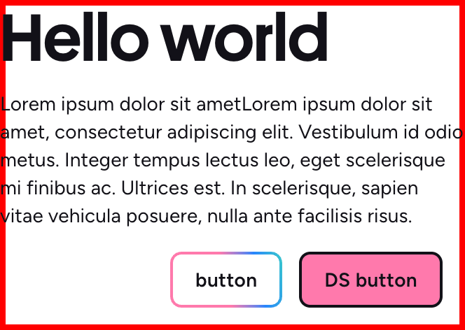
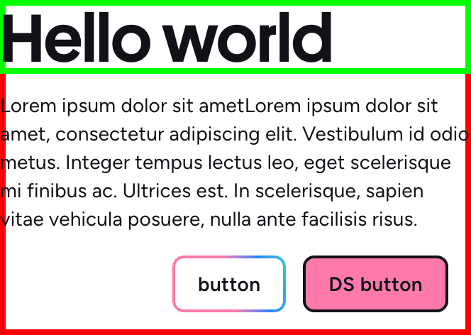
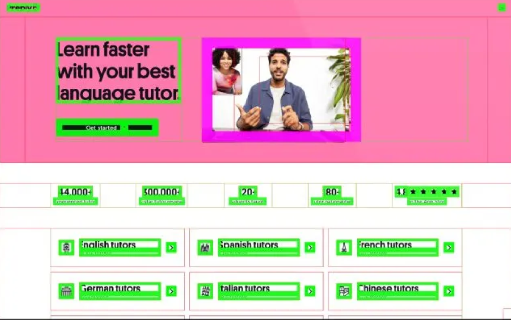

The story of how we measure the impact of our design systems in production!

# Design System Visual Coverage


<div class="abs-br m-6 text-xl">
  <a href="https://github.com/xxxxx" target="_blank" class="slidev-icon-btn">
    <carbon:logo-github />
  </a>
</div>

*Background: image with DS components from Preply and WorkWave*

<!--
Hi everyone!
We will tell you the story of how we measure the impact of our design systems through the Design System Visual Coverage, a project we battle tested in production and released on GitHub.
-->

---
layout: center
---


# Why

To measure the DS impact from a Product perspective

<!--
Let us give you a 1-min introduction before digging into the details of the project:
First of all: the why! We needed a metric the leadership team can understand and use to compare the Design System investments with other initiatives.
So we needed a metric that measure the DS impact from a Product, from a User perspective, not from a technical perspective.
-->

---
layout: center
---

*background: a video that shows the coverage in action*

# What

We measure how much % pages are built with DS components.

<!--
We built something that measure how much percentage of the pages are built with DS components.
You can briefly see it in action here, where we color DOM element's perimeters and we calculate the overall DS impact in percentage.
-->

---
layout: center
---

# How

By using idle callbacks, web workers, typed arrays to not alter the UX, we calculate it in users' devices.

<!--
How we built it: we used many tricks to optimize the CPU and memory performances to be able to run the DS visual coverage straight in production, during user's sessions, but without impacting their UX.
In this talk, we will dig into the why, what and how, and how you can use our DS visual coverage on your product.
-->

---

# Stefano Magni @ Preply

- XXXX
- XXXX
- XXXX

<!-- TODO: -->

---

# Matteo Ronchi @ WorkWave

- XXXX
- XXXX
- XXXX

<!-- TODO: -->

---

# Why

<!--
Let's go back to the Why: We work in DS teams, which are part of the Platform teams. One big difference between Platform teams and Product/Feature teams is how they measure the success of their work.
- Product teams measure their work in conversions/revenues/money
- And DS teams?...
 
Most of the times, DS teams rely on static analysis. By Statically analyzing the codebases we can tell that our amazing button is used 1000 times... But this tells nothing to the leadership team! How are they supposed to be able to compare DS teams with other initiative? How can DS teams prove its value and asl for more investments?
We must be able to tell them how much % of the UI is built with the DS!

Nota per Matte: ho pensato che qui potremmo avere un'immagine con 3 manager seduti al "tavolo della leadership", dove gli altri parlano in % e dollari, e il DS engineer parla di "quanto volte é usato il bottone". Nella mia mente si passa poi alla stessa immagine ma con il DS engineer the dice "il 40% della UI é costruita con il DS". Se questa cosa ti piace modifichiamo leggermente il testo per farlo combaciare con l'immagine.
-->

---

# TBD

<!--
That's why we started thinking about coloring the DOM elements straight on the actual web pages.
We made some POCs: should we measure the usage of the DS tokens? Of the DS components? Should we measure components' areas? perimeters?
(TODO: ti devo mandare gli screenshot degli esperimenti iniziali, poi vedi tu se ha senso usarli)
-->

---

# TBD

<!--
We decided to count the element's perimeters, and the visual coverage formula is `green pixels / (green pixels + red pixels)`.
This gives us a 0-100%, and directly measures what the users see.
The leadership team liked the idea.

Nota per Matte: qui metterei uno screenshot (reale o fittizio) dei rettangoli in pagine dove tutti i componenti hanno lo stesso peso. Questo screenshot cambierá nelle prossime slide.
-->

---

# TBD

<!--
Then we evolved it, and made the visual coverage more meaningful in terms of expressing the DS impact on the users. The components must have different weights because their impact on the UI/UX/accessibility is different. This was a manual and subjective process, and it really depends on the Product.

Nota per Matte: lo screenshot della slide precedente aumenta il peso ad un componente. Poi un altro screenshot con pesi diversi tra componenti, ecc.
-->

---

# TBD

<!--
Then we needed to split pages by teams, because some pages can be owned by multiple Product teams. This is fundamental to identify DS usage issues, and allow Product teams to have a dedicated DS visual coverage percentage, and they can also use it to set their quarterly ORKs.

Nota per Matte: lo screenshot della slide precedente si divide in "pezzi" per mostrare la ownership dei team.

p.s. nel flusso del discorso, non sono sicuro che questo sia il momento migliore di parlare dello split per team... o forse é meglio citarlo nella parte finale... (sempre che abbia senso menzionarlo, potrei anche solo mostrare la dashboard)
-->

---

# TBD

<!--
How
The initial implementation was quite conventional: we were converting the whole page to a png and then count the pixels. This was a big performance bottleneck anyway. A big page required something like 5 seconds on a high-the device. This was a challenge also for CI pipelines! Calculating the coverage at the end of e2e tests would have costed too much.

We could make it faster and run it in CI pipelines... or we could make it even faster and run it... in production, during users' sessions, on their device!

Sounds like a crazy idea? Think about it!
1. Users use all the pages (while E2E tests cover just the happy paths)
2. Measuring the DS impact on what users's see is 100% aligned with the idea of measuring the impact from a Product perspective!
3. There's also another huge convenience: by installing it at the root of the website, the DS team was independent! Mot of the times, Platform teams's initiatives depend on Product teams' help, but Product teams are always busy with their OKRs. So being independent is a huge benefit for us.


Let's look at how we implemented it: the DS visual coverage is made of two steps:
1. Parsing the whole DOM tree to collect element's sizes, and to detect which are generated by DS components
2. Transforming this tree into a bitmap to calculate the coverage

We've optimized both the steps.

Parsing the DOM safely rely on idle callbacks. This is the idea (TODO: add image from Ste's article)
1. The browser tells us when it's idle, and how many remaining milliseconds we have
2. We pause and resume parsing the DOM tree
3. Sometimes we could calculate the coverage on frankestein pages (imagine starting to measure it on a page with an opened modal, and then finishing it when the modal doesn't exist anymore), but on big numbers, this is irrelevant, the only important thing is to leave the UX untouched

Regarding the bitmap:
1. We generate a bidimensional array that represents the page, with thw same screen width and height
2. We set different "colors" for the "pixels". This is necessary to mimic (even if it's not perfect) the CSS depth logics and count the closest-to-the-user elements
3. Then we count the pixels

And all of this happens in a web worker.

So, the whole DS visual coverage doesn't lock the main browser's thread.

This is how we at Preply calculates the coverage every 5 minute, on all the users connected, independently from what they are doing, independently from their device, also on feature phones. More or less, this happen ~300/400K times/day.

Well, there's more to tell... We involved Massimiliano Mantione (yes the one who talked yesterday about the cost of abstractions), who is a former Google Chrome engineer, to help us optimizing the performances even more. Thanks to his suggestions:
1. The array is not bidimensional anymore. A monodimensional array optimizes accessing the memory, because there's just one step to find the pixel, instead of two
2. We use typed arrays to reduce the memory footprint
3. We refactored our code to be branch-free as much as possible: removing branches (if conditions) allows V8 to translate JS almost to C++, with all the performance benefits.

So
1. The initial implementation took 5 blocking seconds on our MacBook pro
2. The first bitmap-based version took 50 blocking ms, and 30MB of memory
3. The final version took 35 non-blocking ms, and 0.3 MB of memory

Since we mentioned feature phones: the Huawei P9 (cheap 2016 phone) takes 900 non-blocking ms on a big page.

Were all this efforts needed? Yes! During the initial tests, when the code wasn't so optimized, we released the visual coverage to just 1% of the users and 1 of them reported 400 blocking ms (TODO: add the image): this isn't acceptable for a brand that wants to offer the bet possible UX. So, yes, it was necessary.

Let's look at it working on Preply.com: for the sake of debugging, some of the DS coverage APIs can be triggered straight from the browser's console. Here you can see, for example, that on my student's home page, the coverage is... and there are two different containers (containers are part of the pag assigned to different teams)
if I go to the search page, the coverage is...
And given it doesn't impact the UX, on Preply we calculate it every 10 minutes on all users connected to our website. And we built this dashboard where we can show the company the overall average. But, from a DS team perspective, we care more about the coverage per teams and how it goes over time, and the coverage per page.


We also needed to implement it for React Native, but...
1. React Native doesn't offer the same convenient worker APIs
2. React Native doesn't offer a way to query the DOM yet

So we opted for a more classic approach: we use E2E tests. At least in Preply, E2E tests for the App cover 90% of the user flows. This, mixed with a small Swift snippet to extract all the available views coordinates, allowed us to calculate the coverage for the app.

BTW: react-strict-dom and worklets could help in the future.


Now, let's also highlight some pros and cons.
The biggest pro is that the DS visual coverage is not bound to Preply. WorkWave is adopting it despite Preply and WorkWave have nothing in common
*Speak about the differences + show the table*

Despite these differences, the DS visual coverage adapts well because
1. Through the configuration, it requires you to identify DOM elements generated by DS components (show a simplified code of Preply vs WW)
2. It requires you set the component weight (code)
3. You can ignore hidden elements (code)
4. You can track "slots", like for modals (screenshot to explain it)
5. You can split the page into different containers to assign them to different teams, but it's optional
6. And yes, it's open source :)


Some cons:
1. Collecting events in Production comes with a cost. For example, Preply spends ~100$/month to collect this high volume of events
- The collected data is not stable (Thinks about the stock market). It depends on what users do, on their devices, on user-generated contents. For example, here you can see the same page, Preply chat, with or without messages (screenshot). The page is the same but the coverage is different.
- It complements static analysis (including with detailed component's props usage), which is fundamental for the DS team, it's not a replacement.
- It's a monitoring metric, you can check the trends but when the coverage goes down, the page is already in prod. So it doesn't help to prevent teams from decreasing their DS usage.
  - For us, it's still hard to say "by implementing this component, we expect an increase of X %". nd guess what? This is what the leadership team wants

The progress so far:
- ✅ Preply Battle tested in production: the visual coverage has run for the last year
- ✅ Detailed articles: the written and more exhaustive version of this talks are available here and here
- ✅ Open Source the project: the project is available here
- 🚧 Implementing a devtool: by working with Preply's Product teams to increase the coverage, we gathered feedback about how to improve the DX
- 🚧 Scaling it at WorkWave: we are doing X and Y (non ricordo precisamente a che punto siete Matte, aggiungilo tu :) )
- 🚧 Helping Docplanner and Monday.com to adopt it (I asked them if we can mention them)

Thanks to:
(list people)


FINAL SLIDE
1. Links to articles, repo, us, preply careers, WW careers

Other resources
1. Articolo di Uber
2. Articolo di Rei
3. Articolo di Cristiano Rastelli


-->
---
layout: two-cols
---

Step by step


DOM parse result
```json
[


]
```

::right::

Bitmap
```
⬛️⬛️⬛️⬛️⬛️⬛️⬛️⬛️⬛️⬛️⬛️⬛️⬛️⬛️⬛️⬛️⬛️⬛️⬛️⬛️
⬛️⬛️⬛️⬛️⬛️⬛️⬛️⬛️⬛️⬛️⬛️⬛️⬛️⬛️⬛️⬛️⬛️⬛️⬛️⬛️
⬛️⬛️⬛️⬛️⬛️⬛️⬛️⬛️⬛️⬛️⬛️⬛️⬛️⬛️⬛️⬛️⬛️⬛️⬛️⬛️
⬛️⬛️⬛️⬛️⬛️⬛️⬛️⬛️⬛️⬛️⬛️⬛️⬛️⬛️⬛️⬛️⬛️⬛️⬛️⬛️
⬛️⬛️⬛️⬛️⬛️⬛️⬛️⬛️⬛️⬛️⬛️⬛️⬛️⬛️⬛️⬛️⬛️⬛️⬛️⬛️
⬛️⬛️⬛️⬛️⬛️⬛️⬛️⬛️⬛️⬛️⬛️⬛️⬛️⬛️⬛️⬛️⬛️⬛️⬛️⬛️
⬛️⬛️⬛️⬛️⬛️⬛️⬛️⬛️⬛️⬛️⬛️⬛️⬛️⬛️⬛️⬛️⬛️⬛️⬛️⬛️
⬛️⬛️⬛️⬛️⬛️⬛️⬛️⬛️⬛️⬛️⬛️⬛️⬛️⬛️⬛️⬛️⬛️⬛️⬛️⬛️
⬛️⬛️⬛️⬛️⬛️⬛️⬛️⬛️⬛️⬛️⬛️⬛️⬛️⬛️⬛️⬛️⬛️⬛️⬛️⬛️
⬛️⬛️⬛️⬛️⬛️⬛️⬛️⬛️⬛️⬛️⬛️⬛️⬛️⬛️⬛️⬛️⬛️⬛️⬛️⬛️
⬛️⬛️⬛️⬛️⬛️⬛️⬛️⬛️⬛️⬛️⬛️⬛️⬛️⬛️⬛️⬛️⬛️⬛️⬛️⬛️
⬛️⬛️⬛️⬛️⬛️⬛️⬛️⬛️⬛️⬛️⬛️⬛️⬛️⬛️⬛️⬛️⬛️⬛️⬛️⬛️
⬛️⬛️⬛️⬛️⬛️⬛️⬛️⬛️⬛️⬛️⬛️⬛️⬛️⬛️⬛️⬛️⬛️⬛️⬛️⬛️
⬛️⬛️⬛️⬛️⬛️⬛️⬛️⬛️⬛️⬛️⬛️⬛️⬛️⬛️⬛️⬛️⬛️⬛️⬛️⬛️
⬛️⬛️⬛️⬛️⬛️⬛️⬛️⬛️⬛️⬛️⬛️⬛️⬛️⬛️⬛️⬛️⬛️⬛️⬛️⬛️
⬛️⬛️⬛️⬛️⬛️⬛️⬛️⬛️⬛️⬛️⬛️⬛️⬛️⬛️⬛️⬛️⬛️⬛️⬛️⬛️
```

---
layout: two-cols
---

Step by step



DOM parse result
```json
[


]
```

::right::

Bitmap
```
⬛️⬛️⬛️⬛️⬛️⬛️⬛️⬛️⬛️⬛️⬛️⬛️⬛️⬛️⬛️⬛️⬛️⬛️⬛️⬛️
⬛️⬛️⬛️⬛️⬛️⬛️⬛️⬛️⬛️⬛️⬛️⬛️⬛️⬛️⬛️⬛️⬛️⬛️⬛️⬛️
⬛️⬛️⬛️⬛️⬛️⬛️⬛️⬛️⬛️⬛️⬛️⬛️⬛️⬛️⬛️⬛️⬛️⬛️⬛️⬛️
⬛️⬛️⬛️⬛️⬛️⬛️⬛️⬛️⬛️⬛️⬛️⬛️⬛️⬛️⬛️⬛️⬛️⬛️⬛️⬛️
⬛️⬛️⬛️⬛️⬛️⬛️⬛️⬛️⬛️⬛️⬛️⬛️⬛️⬛️⬛️⬛️⬛️⬛️⬛️⬛️
⬛️⬛️⬛️⬛️⬛️⬛️⬛️⬛️⬛️⬛️⬛️⬛️⬛️⬛️⬛️⬛️⬛️⬛️⬛️⬛️
⬛️⬛️⬛️⬛️⬛️⬛️⬛️⬛️⬛️⬛️⬛️⬛️⬛️⬛️⬛️⬛️⬛️⬛️⬛️⬛️
⬛️⬛️⬛️⬛️⬛️⬛️⬛️⬛️⬛️⬛️⬛️⬛️⬛️⬛️⬛️⬛️⬛️⬛️⬛️⬛️
⬛️⬛️⬛️⬛️⬛️⬛️⬛️⬛️⬛️⬛️⬛️⬛️⬛️⬛️⬛️⬛️⬛️⬛️⬛️⬛️
⬛️⬛️⬛️⬛️⬛️⬛️⬛️⬛️⬛️⬛️⬛️⬛️⬛️⬛️⬛️⬛️⬛️⬛️⬛️⬛️
⬛️⬛️⬛️⬛️⬛️⬛️⬛️⬛️⬛️⬛️⬛️⬛️⬛️⬛️⬛️⬛️⬛️⬛️⬛️⬛️
⬛️⬛️⬛️⬛️⬛️⬛️⬛️⬛️⬛️⬛️⬛️⬛️⬛️⬛️⬛️⬛️⬛️⬛️⬛️⬛️
⬛️⬛️⬛️⬛️⬛️⬛️⬛️⬛️⬛️⬛️⬛️⬛️⬛️⬛️⬛️⬛️⬛️⬛️⬛️⬛️
⬛️⬛️⬛️⬛️⬛️⬛️⬛️⬛️⬛️⬛️⬛️⬛️⬛️⬛️⬛️⬛️⬛️⬛️⬛️⬛️
⬛️⬛️⬛️⬛️⬛️⬛️⬛️⬛️⬛️⬛️⬛️⬛️⬛️⬛️⬛️⬛️⬛️⬛️⬛️⬛️
⬛️⬛️⬛️⬛️⬛️⬛️⬛️⬛️⬛️⬛️⬛️⬛️⬛️⬛️⬛️⬛️⬛️⬛️⬛️⬛️
```
---
layout: two-cols
---

Step by step


DOM parse result
```json
[
  { "rect": [0, 0, 20, 17] }


]
```

::right::

Bitmap
```
⬛️⬛️⬛️⬛️⬛️⬛️⬛️⬛️⬛️⬛️⬛️⬛️⬛️⬛️⬛️⬛️⬛️⬛️⬛️⬛️
⬛️⬛️⬛️⬛️⬛️⬛️⬛️⬛️⬛️⬛️⬛️⬛️⬛️⬛️⬛️⬛️⬛️⬛️⬛️⬛️
⬛️⬛️⬛️⬛️⬛️⬛️⬛️⬛️⬛️⬛️⬛️⬛️⬛️⬛️⬛️⬛️⬛️⬛️⬛️⬛️
⬛️⬛️⬛️⬛️⬛️⬛️⬛️⬛️⬛️⬛️⬛️⬛️⬛️⬛️⬛️⬛️⬛️⬛️⬛️⬛️
⬛️⬛️⬛️⬛️⬛️⬛️⬛️⬛️⬛️⬛️⬛️⬛️⬛️⬛️⬛️⬛️⬛️⬛️⬛️⬛️
⬛️⬛️⬛️⬛️⬛️⬛️⬛️⬛️⬛️⬛️⬛️⬛️⬛️⬛️⬛️⬛️⬛️⬛️⬛️⬛️
⬛️⬛️⬛️⬛️⬛️⬛️⬛️⬛️⬛️⬛️⬛️⬛️⬛️⬛️⬛️⬛️⬛️⬛️⬛️⬛️
⬛️⬛️⬛️⬛️⬛️⬛️⬛️⬛️⬛️⬛️⬛️⬛️⬛️⬛️⬛️⬛️⬛️⬛️⬛️⬛️
⬛️⬛️⬛️⬛️⬛️⬛️⬛️⬛️⬛️⬛️⬛️⬛️⬛️⬛️⬛️⬛️⬛️⬛️⬛️⬛️
⬛️⬛️⬛️⬛️⬛️⬛️⬛️⬛️⬛️⬛️⬛️⬛️⬛️⬛️⬛️⬛️⬛️⬛️⬛️⬛️
⬛️⬛️⬛️⬛️⬛️⬛️⬛️⬛️⬛️⬛️⬛️⬛️⬛️⬛️⬛️⬛️⬛️⬛️⬛️⬛️
⬛️⬛️⬛️⬛️⬛️⬛️⬛️⬛️⬛️⬛️⬛️⬛️⬛️⬛️⬛️⬛️⬛️⬛️⬛️⬛️
⬛️⬛️⬛️⬛️⬛️⬛️⬛️⬛️⬛️⬛️⬛️⬛️⬛️⬛️⬛️⬛️⬛️⬛️⬛️⬛️
⬛️⬛️⬛️⬛️⬛️⬛️⬛️⬛️⬛️⬛️⬛️⬛️⬛️⬛️⬛️⬛️⬛️⬛️⬛️⬛️
⬛️⬛️⬛️⬛️⬛️⬛️⬛️⬛️⬛️⬛️⬛️⬛️⬛️⬛️⬛️⬛️⬛️⬛️⬛️⬛️
⬛️⬛️⬛️⬛️⬛️⬛️⬛️⬛️⬛️⬛️⬛️⬛️⬛️⬛️⬛️⬛️⬛️⬛️⬛️⬛️
```
---
layout: two-cols
---

Step by step


DOM parse result
```json
[
  { "rect": [0, 0, 20, 17] }


]
```

::right::

Bitmap
```
🟥🟥🟥🟥🟥🟥🟥🟥🟥🟥🟥🟥🟥🟥🟥🟥🟥🟥🟥🟥
🟥⬛️⬛️⬛️⬛️⬛️⬛️⬛️⬛️⬛️⬛️⬛️⬛️⬛️⬛️⬛️⬛️⬛️⬛️🟥
🟥⬛️⬛️⬛️⬛️⬛️⬛️⬛️⬛️⬛️⬛️⬛️⬛️⬛️⬛️⬛️⬛️⬛️⬛️🟥
🟥⬛️⬛️⬛️⬛️⬛️⬛️⬛️⬛️⬛️⬛️⬛️⬛️⬛️⬛️⬛️⬛️⬛️⬛️🟥
🟥⬛️⬛️⬛️⬛️⬛️⬛️⬛️⬛️⬛️⬛️⬛️⬛️⬛️⬛️⬛️⬛️⬛️⬛️🟥
🟥⬛️⬛️⬛️⬛️⬛️⬛️⬛️⬛️⬛️⬛️⬛️⬛️⬛️⬛️⬛️⬛️⬛️⬛️🟥
🟥⬛️⬛️⬛️⬛️⬛️⬛️⬛️⬛️⬛️⬛️⬛️⬛️⬛️⬛️⬛️⬛️⬛️⬛️🟥
🟥⬛️⬛️⬛️⬛️⬛️⬛️⬛️⬛️⬛️⬛️⬛️⬛️⬛️⬛️⬛️⬛️⬛️⬛️🟥
🟥⬛️⬛️⬛️⬛️⬛️⬛️⬛️⬛️⬛️⬛️⬛️⬛️⬛️⬛️⬛️⬛️⬛️⬛️🟥
🟥⬛️⬛️⬛️⬛️⬛️⬛️⬛️⬛️⬛️⬛️⬛️⬛️⬛️⬛️⬛️⬛️⬛️⬛️🟥
🟥⬛️⬛️⬛️⬛️⬛️⬛️⬛️⬛️⬛️⬛️⬛️⬛️⬛️⬛️⬛️⬛️⬛️⬛️🟥
🟥⬛️⬛️⬛️⬛️⬛️⬛️⬛️⬛️⬛️⬛️⬛️⬛️⬛️⬛️⬛️⬛️⬛️⬛️🟥
🟥⬛️⬛️⬛️⬛️⬛️⬛️⬛️⬛️⬛️⬛️⬛️⬛️⬛️⬛️⬛️⬛️⬛️⬛️🟥
🟥⬛️⬛️⬛️⬛️⬛️⬛️⬛️⬛️⬛️⬛️⬛️⬛️⬛️⬛️⬛️⬛️⬛️⬛️🟥
🟥⬛️⬛️⬛️⬛️⬛️⬛️⬛️⬛️⬛️⬛️⬛️⬛️⬛️⬛️⬛️⬛️⬛️⬛️🟥
🟥🟥🟥🟥🟥🟥🟥🟥🟥🟥🟥🟥🟥🟥🟥🟥🟥🟥🟥🟥
```

---
layout: two-cols
---

Step by step



DOM parse result
```json
[
  { "rect": [0, 0, 20, 15] },
  


]
```

::right::

Bitmap
```
🟥🟥🟥🟥🟥🟥🟥🟥🟥🟥🟥🟥🟥🟥🟥🟥🟥🟥🟥🟥
🟥⬛️⬛️⬛️⬛️⬛️⬛️⬛️⬛️⬛️⬛️⬛️⬛️⬛️⬛️⬛️⬛️⬛️⬛️🟥
🟥⬛️⬛️⬛️⬛️⬛️⬛️⬛️⬛️⬛️⬛️⬛️⬛️⬛️⬛️⬛️⬛️⬛️⬛️🟥
🟥⬛️⬛️⬛️⬛️⬛️⬛️⬛️⬛️⬛️⬛️⬛️⬛️⬛️⬛️⬛️⬛️⬛️⬛️🟥
🟥⬛️⬛️⬛️⬛️⬛️⬛️⬛️⬛️⬛️⬛️⬛️⬛️⬛️⬛️⬛️⬛️⬛️⬛️🟥
🟥⬛️⬛️⬛️⬛️⬛️⬛️⬛️⬛️⬛️⬛️⬛️⬛️⬛️⬛️⬛️⬛️⬛️⬛️🟥
🟥⬛️⬛️⬛️⬛️⬛️⬛️⬛️⬛️⬛️⬛️⬛️⬛️⬛️⬛️⬛️⬛️⬛️⬛️🟥
🟥⬛️⬛️⬛️⬛️⬛️⬛️⬛️⬛️⬛️⬛️⬛️⬛️⬛️⬛️⬛️⬛️⬛️⬛️🟥
🟥⬛️⬛️⬛️⬛️⬛️⬛️⬛️⬛️⬛️⬛️⬛️⬛️⬛️⬛️⬛️⬛️⬛️⬛️🟥
🟥⬛️⬛️⬛️⬛️⬛️⬛️⬛️⬛️⬛️⬛️⬛️⬛️⬛️⬛️⬛️⬛️⬛️⬛️🟥
🟥⬛️⬛️⬛️⬛️⬛️⬛️⬛️⬛️⬛️⬛️⬛️⬛️⬛️⬛️⬛️⬛️⬛️⬛️🟥
🟥⬛️⬛️⬛️⬛️⬛️⬛️⬛️⬛️⬛️⬛️⬛️⬛️⬛️⬛️⬛️⬛️⬛️⬛️🟥
🟥⬛️⬛️⬛️⬛️⬛️⬛️⬛️⬛️⬛️⬛️⬛️⬛️⬛️⬛️⬛️⬛️⬛️⬛️🟥
🟥⬛️⬛️⬛️⬛️⬛️⬛️⬛️⬛️⬛️⬛️⬛️⬛️⬛️⬛️⬛️⬛️⬛️⬛️🟥
🟥⬛️⬛️⬛️⬛️⬛️⬛️⬛️⬛️⬛️⬛️⬛️⬛️⬛️⬛️⬛️⬛️⬛️⬛️🟥
🟥🟥🟥🟥🟥🟥🟥🟥🟥🟥🟥🟥🟥🟥🟥🟥🟥🟥🟥🟥
```
---
layout: two-cols
---

Step by step


DOM parse result
```json
[
  { "rect": [0, 0, 20, 15] },
  { "rect": [0, 0, 20, 4], "dsComponentName": "Heading" }


]
```

::right::

Bitmap
```
🟥🟥🟥🟥🟥🟥🟥🟥🟥🟥🟥🟥🟥🟥🟥🟥🟥🟥🟥🟥
🟥⬛️⬛️⬛️⬛️⬛️⬛️⬛️⬛️⬛️⬛️⬛️⬛️⬛️⬛️⬛️⬛️⬛️⬛️🟥
🟥⬛️⬛️⬛️⬛️⬛️⬛️⬛️⬛️⬛️⬛️⬛️⬛️⬛️⬛️⬛️⬛️⬛️⬛️🟥
🟥⬛️⬛️⬛️⬛️⬛️⬛️⬛️⬛️⬛️⬛️⬛️⬛️⬛️⬛️⬛️⬛️⬛️⬛️🟥
🟥⬛️⬛️⬛️⬛️⬛️⬛️⬛️⬛️⬛️⬛️⬛️⬛️⬛️⬛️⬛️⬛️⬛️⬛️🟥
🟥⬛️⬛️⬛️⬛️⬛️⬛️⬛️⬛️⬛️⬛️⬛️⬛️⬛️⬛️⬛️⬛️⬛️⬛️🟥
🟥⬛️⬛️⬛️⬛️⬛️⬛️⬛️⬛️⬛️⬛️⬛️⬛️⬛️⬛️⬛️⬛️⬛️⬛️🟥
🟥⬛️⬛️⬛️⬛️⬛️⬛️⬛️⬛️⬛️⬛️⬛️⬛️⬛️⬛️⬛️⬛️⬛️⬛️🟥
🟥⬛️⬛️⬛️⬛️⬛️⬛️⬛️⬛️⬛️⬛️⬛️⬛️⬛️⬛️⬛️⬛️⬛️⬛️🟥
🟥⬛️⬛️⬛️⬛️⬛️⬛️⬛️⬛️⬛️⬛️⬛️⬛️⬛️⬛️⬛️⬛️⬛️⬛️🟥
🟥⬛️⬛️⬛️⬛️⬛️⬛️⬛️⬛️⬛️⬛️⬛️⬛️⬛️⬛️⬛️⬛️⬛️⬛️🟥
🟥⬛️⬛️⬛️⬛️⬛️⬛️⬛️⬛️⬛️⬛️⬛️⬛️⬛️⬛️⬛️⬛️⬛️⬛️🟥
🟥⬛️⬛️⬛️⬛️⬛️⬛️⬛️⬛️⬛️⬛️⬛️⬛️⬛️⬛️⬛️⬛️⬛️⬛️🟥
🟥⬛️⬛️⬛️⬛️⬛️⬛️⬛️⬛️⬛️⬛️⬛️⬛️⬛️⬛️⬛️⬛️⬛️⬛️🟥
🟥⬛️⬛️⬛️⬛️⬛️⬛️⬛️⬛️⬛️⬛️⬛️⬛️⬛️⬛️⬛️⬛️⬛️⬛️🟥
🟥🟥🟥🟥🟥🟥🟥🟥🟥🟥🟥🟥🟥🟥🟥🟥🟥🟥🟥🟥
```
---
layout: two-cols
---

Step by step


DOM parse result
```json
[
  { "rect": [0, 0, 20, 15] },
  { "rect": [0, 0, 20, 4], "dsComponentName": "Heading" }


]
```

::right::

Bitmap
```
🟩🟩🟩🟩🟩🟩🟩🟩🟩🟩🟩🟩🟩🟩🟩🟩🟩🟩🟩🟩
🟩⬛️⬛️⬛️⬛️⬛️⬛️⬛️⬛️⬛️⬛️⬛️⬛️⬛️⬛️⬛️⬛️⬛️⬛️🟩
🟩🟩🟩🟩🟩🟩🟩🟩🟩🟩🟩🟩🟩🟩🟩🟩🟩🟩🟩🟩
🟥⬛️⬛️⬛️⬛️⬛️⬛️⬛️⬛️⬛️⬛️⬛️⬛️⬛️⬛️⬛️⬛️⬛️⬛️🟥
🟥⬛️⬛️⬛️⬛️⬛️⬛️⬛️⬛️⬛️⬛️⬛️⬛️⬛️⬛️⬛️⬛️⬛️⬛️🟥
🟥⬛️⬛️⬛️⬛️⬛️⬛️⬛️⬛️⬛️⬛️⬛️⬛️⬛️⬛️⬛️⬛️⬛️⬛️🟥
🟥⬛️⬛️⬛️⬛️⬛️⬛️⬛️⬛️⬛️⬛️⬛️⬛️⬛️⬛️⬛️⬛️⬛️⬛️🟥
🟥⬛️⬛️⬛️⬛️⬛️⬛️⬛️⬛️⬛️⬛️⬛️⬛️⬛️⬛️⬛️⬛️⬛️⬛️🟥
🟥⬛️⬛️⬛️⬛️⬛️⬛️⬛️⬛️⬛️⬛️⬛️⬛️⬛️⬛️⬛️⬛️⬛️⬛️🟥
🟥⬛️⬛️⬛️⬛️⬛️⬛️⬛️⬛️⬛️⬛️⬛️⬛️⬛️⬛️⬛️⬛️⬛️⬛️🟥
🟥⬛️⬛️⬛️⬛️⬛️⬛️⬛️⬛️⬛️⬛️⬛️⬛️⬛️⬛️⬛️⬛️⬛️⬛️🟥
🟥⬛️⬛️⬛️⬛️⬛️⬛️⬛️⬛️⬛️⬛️⬛️⬛️⬛️⬛️⬛️⬛️⬛️⬛️🟥
🟥⬛️⬛️⬛️⬛️⬛️⬛️⬛️⬛️⬛️⬛️⬛️⬛️⬛️⬛️⬛️⬛️⬛️⬛️🟥
🟥⬛️⬛️⬛️⬛️⬛️⬛️⬛️⬛️⬛️⬛️⬛️⬛️⬛️⬛️⬛️⬛️⬛️⬛️🟥
🟥⬛️⬛️⬛️⬛️⬛️⬛️⬛️⬛️⬛️⬛️⬛️⬛️⬛️⬛️⬛️⬛️⬛️⬛️🟥
🟥🟥🟥🟥🟥🟥🟥🟥🟥🟥🟥🟥🟥🟥🟥🟥🟥🟥🟥🟥
```

---
layout: two-cols
---

Step by step


DOM parse result
```json
[
  { "rect": [0, 0, 20, 15] },
  { "rect": [0, 0, 20, 3], "dsComponentName": "Heading" },
  { "rect": [8, 0, 20, 4], "dsComponentName": "Text" },


]
```

::right::

Bitmap
```
🟩🟩🟩🟩🟩🟩🟩🟩🟩🟩🟩🟩🟩🟩🟩🟩🟩🟩🟩🟩
🟩⬛️⬛️⬛️⬛️⬛️⬛️⬛️⬛️⬛️⬛️⬛️⬛️⬛️⬛️⬛️⬛️⬛️⬛️🟩
🟩🟩🟩🟩🟩🟩🟩🟩🟩🟩🟩🟩🟩🟩🟩🟩🟩🟩🟩🟩
🟥⬛️⬛️⬛️⬛️⬛️⬛️⬛️⬛️⬛️⬛️⬛️⬛️⬛️⬛️⬛️⬛️⬛️⬛️🟥
🟩🟩🟩🟩🟩🟩🟩🟩🟩🟩🟩🟩🟩🟩🟩🟩🟩🟩🟩🟩
🟩⬛️⬛️⬛️⬛️⬛️⬛️⬛️⬛️⬛️⬛️⬛️⬛️⬛️⬛️⬛️⬛️⬛️⬛️🟩
🟩⬛️⬛️⬛️⬛️⬛️⬛️⬛️⬛️⬛️⬛️⬛️⬛️⬛️⬛️⬛️⬛️⬛️⬛️🟩
🟩🟩🟩🟩🟩🟩🟩🟩🟩🟩🟩🟩🟩🟩🟩🟩🟩🟩🟩🟩
🟥⬛️⬛️⬛️⬛️⬛️⬛️⬛️⬛️⬛️⬛️⬛️⬛️⬛️⬛️⬛️⬛️⬛️⬛️🟥
🟥⬛️⬛️⬛️⬛️⬛️⬛️⬛️⬛️⬛️⬛️⬛️⬛️⬛️⬛️⬛️⬛️⬛️⬛️🟥
🟥⬛️⬛️⬛️⬛️⬛️⬛️⬛️⬛️⬛️⬛️⬛️⬛️⬛️⬛️⬛️⬛️⬛️⬛️🟥
🟥⬛️⬛️⬛️⬛️⬛️⬛️⬛️⬛️⬛️⬛️⬛️⬛️⬛️⬛️⬛️⬛️⬛️⬛️🟥
🟥⬛️⬛️⬛️⬛️⬛️⬛️⬛️⬛️⬛️⬛️⬛️⬛️⬛️⬛️⬛️⬛️⬛️⬛️🟥
🟥⬛️⬛️⬛️⬛️⬛️⬛️⬛️⬛️⬛️⬛️⬛️⬛️⬛️⬛️⬛️⬛️⬛️⬛️🟥
🟥⬛️⬛️⬛️⬛️⬛️⬛️⬛️⬛️⬛️⬛️⬛️⬛️⬛️⬛️⬛️⬛️⬛️⬛️🟥
🟥🟥🟥🟥🟥🟥🟥🟥🟥🟥🟥🟥🟥🟥🟥🟥🟥🟥🟥🟥
```

---
layout: two-cols
---

Step by step


DOM parse result
```json
[
  { "rect": [0, 0, 20, 15] },
  { "rect": [0, 0, 20, 3], "dsComponentName": "Heading" },
  { "rect": [8, 0, 20, 4], "dsComponentName": "Text" },
  { "rect": [16, 3, 8, 4] }

]
```

::right::

Bitmap
```
🟩🟩🟩🟩🟩🟩🟩🟩🟩🟩🟩🟩🟩🟩🟩🟩🟩🟩🟩🟩
🟩⬛️⬛️⬛️⬛️⬛️⬛️⬛️⬛️⬛️⬛️⬛️⬛️⬛️⬛️⬛️⬛️⬛️⬛️🟩
🟩🟩🟩🟩🟩🟩🟩🟩🟩🟩🟩🟩🟩🟩🟩🟩🟩🟩🟩🟩
🟥⬛️⬛️⬛️⬛️⬛️⬛️⬛️⬛️⬛️⬛️⬛️⬛️⬛️⬛️⬛️⬛️⬛️⬛️🟥
🟩🟩🟩🟩🟩🟩🟩🟩🟩🟩🟩🟩🟩🟩🟩🟩🟩🟩🟩🟩
🟩⬛️⬛️⬛️⬛️⬛️⬛️⬛️⬛️⬛️⬛️⬛️⬛️⬛️⬛️⬛️⬛️⬛️⬛️🟩
🟩⬛️⬛️⬛️⬛️⬛️⬛️⬛️⬛️⬛️⬛️⬛️⬛️⬛️⬛️⬛️⬛️⬛️⬛️🟩
🟩🟩🟩🟩🟩🟩🟩🟩🟩🟩🟩🟩🟩🟩🟩🟩🟩🟩🟩🟩
🟥⬛️⬛️⬛️⬛️⬛️⬛️⬛️⬛️⬛️⬛️⬛️⬛️⬛️⬛️⬛️⬛️⬛️⬛️🟥
🟥⬛️⬛️⬛️🟥🟥🟥🟥🟥🟥🟥⬛️⬛️⬛️⬛️⬛️⬛️⬛️⬛️🟥
🟥⬛️⬛️⬛️🟥⬛️⬛️⬛️⬛️⬛️🟥⬛️⬛️⬛️⬛️⬛️⬛️⬛️⬛️🟥
🟥⬛️⬛️⬛️🟥⬛️⬛️⬛️⬛️⬛️🟥⬛️⬛️⬛️⬛️⬛️⬛️⬛️⬛️🟥
🟥⬛️⬛️⬛️🟥⬛️⬛️⬛️⬛️⬛️🟥⬛️⬛️⬛️⬛️⬛️⬛️⬛️⬛️🟥
🟥⬛️⬛️⬛️🟥🟥🟥🟥🟥🟥🟥⬛️⬛️⬛️⬛️⬛️⬛️⬛️⬛️🟥
🟥⬛️⬛️⬛️⬛️⬛️⬛️⬛️⬛️⬛️⬛️⬛️⬛️⬛️⬛️⬛️⬛️⬛️⬛️🟥
🟥🟥🟥🟥🟥🟥🟥🟥🟥🟥🟥🟥🟥🟥🟥🟥🟥🟥🟥🟥
```

---
layout: two-cols
---

Step by step


DOM parse result
```json
[
  { "rect": [0, 0, 20, 15] },
  { "rect": [0, 0, 20, 3], "dsComponentName": "Heading" },
  { "rect": [8, 0, 20, 4], "dsComponentName": "Text" },
  { "rect": [16, 3, 8, 4] }
  {
    "rect": [16, 12, 8, 4],
    "dsComponentName": "Button",
    "weight": 2
  },
]
```

::right::

Bitmap
```
🟩🟩🟩🟩🟩🟩🟩🟩🟩🟩🟩🟩🟩🟩🟩🟩🟩🟩🟩🟩
🟩⬛️⬛️⬛️⬛️⬛️⬛️⬛️⬛️⬛️⬛️⬛️⬛️⬛️⬛️⬛️⬛️⬛️⬛️🟩
🟩🟩🟩🟩🟩🟩🟩🟩🟩🟩🟩🟩🟩🟩🟩🟩🟩🟩🟩🟩
🟥⬛️⬛️⬛️⬛️⬛️⬛️⬛️⬛️⬛️⬛️⬛️⬛️⬛️⬛️⬛️⬛️⬛️⬛️🟥
🟩🟩🟩🟩🟩🟩🟩🟩🟩🟩🟩🟩🟩🟩🟩🟩🟩🟩🟩🟩
🟩⬛️⬛️⬛️⬛️⬛️⬛️⬛️⬛️⬛️⬛️⬛️⬛️⬛️⬛️⬛️⬛️⬛️⬛️🟩
🟩⬛️⬛️⬛️⬛️⬛️⬛️⬛️⬛️⬛️⬛️⬛️⬛️⬛️⬛️⬛️⬛️⬛️⬛️🟩
🟩🟩🟩🟩🟩🟩🟩🟩🟩🟩🟩🟩🟩🟩🟩🟩🟩🟩🟩🟩
🟥⬛️⬛️⬛️⬛️⬛️⬛️⬛️⬛️⬛️⬛️⬛️⬛️⬛️⬛️⬛️⬛️⬛️⬛️🟥
🟥⬛️⬛️⬛️🟥🟥🟥🟥🟥🟥🟥⬛️🟩🟩🟩🟩🟩🟩🟩🟩
🟥⬛️⬛️⬛️🟥⬛️⬛️⬛️⬛️⬛️🟥⬛️🟩🟩🟩🟩🟩🟩🟩🟩
🟥⬛️⬛️⬛️🟥⬛️⬛️⬛️⬛️⬛️🟥⬛️🟩🟩⬛️⬛️⬛️⬛️🟩🟩
🟥⬛️⬛️⬛️🟥⬛️⬛️⬛️⬛️⬛️🟥⬛️🟩🟩🟩🟩🟩🟩🟩🟩
🟥⬛️⬛️⬛️🟥🟥🟥🟥🟥🟥🟥⬛️🟩🟩🟩🟩🟩🟩🟩🟩
🟥⬛️⬛️⬛️⬛️⬛️⬛️⬛️⬛️⬛️⬛️⬛️⬛️⬛️⬛️⬛️⬛️⬛️⬛️🟥
🟥🟥🟥🟥🟥🟥🟥🟥🟥🟥🟥🟥🟥🟥🟥🟥🟥🟥🟥🟥
```

---
layout: two-cols
---

Step by step


DOM parse result
```json
[
  { "rect": [0, 0, 20, 15] },
  { "rect": [0, 0, 20, 3], "dsComponentName": "Heading" },
  { "rect": [8, 0, 20, 4], "dsComponentName": "Text" },
  { "rect": [16, 3, 8, 4] }
  {
    "rect": [16, 12, 8, 4],
    "dsComponentName": "Button",
    "weight": 2
  },
]
```

::right::

Bitmap
```
🟩🟩🟩🟩🟩🟩🟩🟩🟩🟩🟩🟩🟩🟩🟩🟩🟩🟩🟩🟩
🟩⬛️⬛️⬛️⬛️⬛️⬛️⬛️⬛️⬛️⬛️⬛️⬛️⬛️⬛️⬛️⬛️⬛️⬛️🟩
🟩🟩🟩🟩🟩🟩🟩🟩🟩🟩🟩🟩🟩🟩🟩🟩🟩🟩🟩🟩
🟥⬛️⬛️⬛️⬛️⬛️⬛️⬛️⬛️⬛️⬛️⬛️⬛️⬛️⬛️⬛️⬛️⬛️⬛️🟥
🟩🟩🟩🟩🟩🟩🟩🟩🟩🟩🟩🟩🟩🟩🟩🟩🟩🟩🟩🟩
🟩⬛️⬛️⬛️⬛️⬛️⬛️⬛️⬛️⬛️⬛️⬛️⬛️⬛️⬛️⬛️⬛️⬛️⬛️🟩
🟩⬛️⬛️⬛️⬛️⬛️⬛️⬛️⬛️⬛️⬛️⬛️⬛️⬛️⬛️⬛️⬛️⬛️⬛️🟩
🟩🟩🟩🟩🟩🟩🟩🟩🟩🟩🟩🟩🟩🟩🟩🟩🟩🟩🟩🟩
🟥⬛️⬛️⬛️⬛️⬛️⬛️⬛️⬛️⬛️⬛️⬛️⬛️⬛️⬛️⬛️⬛️⬛️⬛️🟥
🟥⬛️⬛️⬛️🟥🟥🟥🟥🟥🟥🟥⬛️🟩🟩🟩🟩🟩🟩🟩🟩
🟥⬛️⬛️⬛️🟥⬛️⬛️⬛️⬛️⬛️🟥⬛️🟩🟩🟩🟩🟩🟩🟩🟩
🟥⬛️⬛️⬛️🟥⬛️⬛️⬛️⬛️⬛️🟥⬛️🟩🟩⬛️⬛️⬛️⬛️🟩🟩
🟥⬛️⬛️⬛️🟥⬛️⬛️⬛️⬛️⬛️🟥⬛️🟩🟩🟩🟩🟩🟩🟩🟩
🟥⬛️⬛️⬛️🟥🟥🟥🟥🟥🟥🟥⬛️🟩🟩🟩🟩🟩🟩🟩🟩
🟥⬛️⬛️⬛️⬛️⬛️⬛️⬛️⬛️⬛️⬛️⬛️⬛️⬛️⬛️⬛️⬛️⬛️⬛️🟥
🟥🟥🟥🟥🟥🟥🟥🟥🟥🟥🟥🟥🟥🟥🟥🟥🟥🟥🟥🟥
```

🟩 = 122
<br/>
🟥 = 51

DS visual coverage = 70.5 %

---

# "Paint" over the DOM!

- We color DOM elements
- Battle tested in production
- Open source
- 100% plain JS

---
layout: center
---

# Wait a moment...

---
layout: center
class: text-center
---

# Coloring DOM elements ain't nothing new!


---
layout: center
class: text-center
---

# But...
# ...doing it on users' devices on a high-traffic website is something no one did!


---
layout: center
class: text-center
---

# We transform
# pixels into bitmaps
# and bitmaps into coverage metrics
<div style="display:flex; gap:8px;">
  
  
  
</div>


---
layout: center
class: text-center
---

# Why are we doing this?

---
layout: image-right
image: https://cover.sli.dev
---

- Our products are very data-oriented
- Platform teams must create long-term strategy and track progress through quarterly OKRs
- Metrics must be approved by the Leadership Team


---
layout: center
class: text-center
---

# What data do DS teams usually use?

---
layout: center
class: text-center
---

# Static Analysis
## How many times is a component used?

---
layout: image-left
image: https://cover.sli.dev
---

Static analysis doesn't help us understand the impact on what users see!


- 1000 button instances doesn't translate to 1000 buttons seen by the users
  - Dead code
  - Not all the pages are equally important
- Data is collected per codebase, not per page/feature

---
layout: center
class: text-center
---

# Visual Coverage
## How the DS impact the users?

---
layout: center
---

- Different pages have different importance
- Data is collected per page and per Product
- Data can be grouped by team
- Metrics that matter for your leadership


---
layout: center
class: text-center
---

# A component's weight

---
layout: center
---

- A component's weight is subjective to your Product
- Smaller elements might weight more


---
layout: cover
background: https://cover.sli.dev
---

## Finetune your components weight

---
layout: statement
class: text-center
---

# When you calculate the coverage?

---
layout: image-right
image: https://cover.sli.dev
---

- E2E tests?
- Story tests?
- Coverage is limited
- Adopting the coverage could affect the teams' velocity

---
layout: two-cols-header
---

# What about adding it straight to production?

::left::

- Calculating the coverage won't affect your teams
- The DS team can operate independently
- We have big numbers

::right::

- It must be done without impacting the UX
- It requires careful performance optimizations
- Preply already runs it in production

---
layout: center
class: text-center
---

# Preply vs WorkWave use cases

---
layout: center
class: text-center
---

# What do they have in common?
## Nothing, but the DS coverage works for both!

---
layout: two-cols
---

# Preply

- B2C
- Millions of users
- A single Product
- Many "connected" teams
- Pages owned by multiple teams
- Pages known in advance (by the DS team)
- Full control over the DS components


::right::

# WorkWave

- B2B
- Thousands of clients
- Multiple independent Products
- Many not "connected" teams
- Pages owned by a single team
- Pages not known in advance (by the DS team)
- Partial control over the DS components

---
layout: center
class: text-center
---

# It's not perfect...

---
layout: center
---


- Collecting events in Production comes with a cost
- The collected data is not stable (Thinks about the stock market)
- It's a monitoring metric
  - It's hard to say "by implementing this component, we expect an increase of X %"
- It complements static analysis, is not a replacement
- It greatly helps you understand the impact of your DS

# ...but it works!

---
layout: image-right
image: https://cover.sli.dev
---

# React Native

- No JS multi-threading
- Luckily, Preply has a lot of E2E tests
- [Worklets](https://developer.mozilla.org/en-US/docs/Web/API/Worklet) FTW


---
layout: image-right
image: https://cover.sli.dev
---

# Progress so far

- ✅ Battle tested in production at Preply
- ✅ Detailed articles
- ✅ Open Source
- 🚧 Implementing a devtool
- 🚧 Scaling it at WorkWave

---
layout: end
---

# Thank You!
